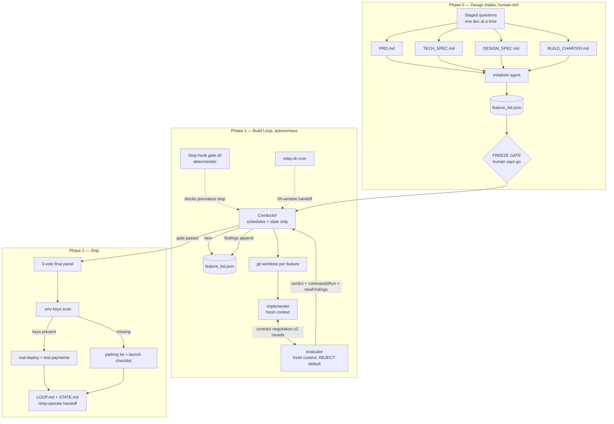

# Architecture

ship-loop is a layered loop: a lean conductor session that never writes code, fresh-context
implementer/evaluator pairs per feature, a deterministic state engine on the file system,
and a script Stop-hook that refuses to let the session quit while work remains.

## The shape

## Where each idea comes from

| Mechanism | Lineage |
|---|---|
| Initializer + feature_list.json (JSON, not markdown) | Anthropic long-running-agents blog: models overwrite markdown, respect JSON |
| Fresh context per feature; conductor stays lean | workshop: compaction ≠ coherence; structured handoffs |
| Generator/evaluator split, REJECT default | workshop: tuning a standalone critic harsh is tractable; self-evaluation is a trap |
| Contract negotiation before code | workshop: "the key innovation the Ralph loop never had — nobody argues with a fixed plan.md" |
| Evidence rules (commandsRun, browser walks) | workshop: the game that "looked done" but arrow keys did nothing |
| reset ("throw it away") path | workshop: independent evaluators willingly restart; generators never do |
| L1→L2 operate discipline, flake quarantine, kill criteria, run log | cobusgreyling/loop-engineering failure catalog |
| Headless fresh-process outer loop | Geoffrey Huntley's Ralph technique |
| Stop-hook gate with deterministic script | own /goal, but the judge runs commands instead of reading chat |

## State files (all under the product's `docs/ship-loop/`)

| File | Writer | Reader |
|---|---|---|
| feature_list.json | state engine only | conductor, agents, gate |
| contracts/F-xxx.md | implementer + evaluator | evaluator (grading), humans (audit) |
| learnings.json | state engine (`learn`) | implementers at startup |
| loop-run-log.md | conductor (append-only) | humans, /ship:status |
| NEEDS_HUMAN.md | conductor + gate | humans |
| HANDOFF.md | conductor at relay | next conductor session |
| ACTIVE / PAUSED / .gate-spin / .relay-at | lifecycle markers | gate.sh, relay.sh |

## Trust boundaries

- Frozen docs are read-only to the loop; spec conflicts park and escalate.
- The Stop-hook exits silently unless THIS project has an ACTIVE, unpaused, unfinished
  run — the plugin must never touch unrelated sessions.
- The standing human gate: executing a real-money charge. Everything else is
  keys-unlocked by charter.
